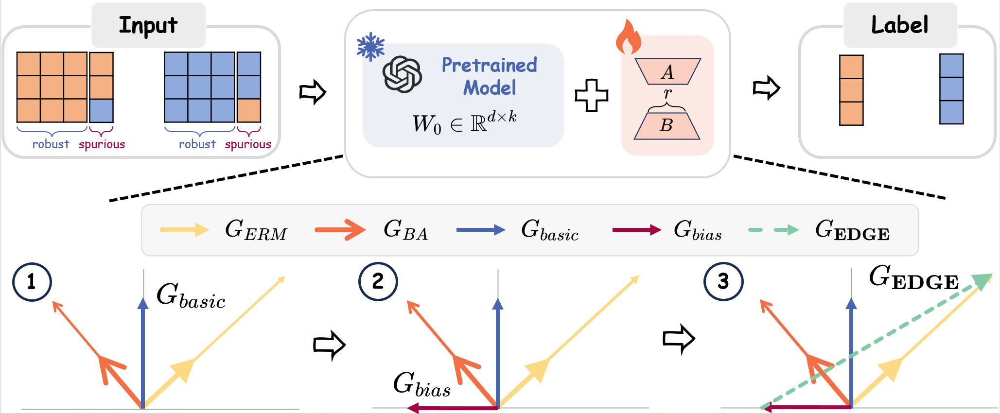

<div align="center">

# Code for the submitted paper 44 
# EDGE: Enhanced Debiased Gradient Extraction for Robust Fine‑tuning



</div>
Abstract:
  Recent advances in large-scale pretraining have substantially enhanced the robustness and generalization capabilities of Transformer-based foundation models. However, when fine-tuned on downstream tasks, these models often latch onto dataset-specific biases, learning spurious correlations tied to easy-to-learn but non-robust features. This undermines their performance under distribution shifts, despite strong in-distribution (ID) accuracy. Existing fine-tuning methods, including full-parameter and parameter-efficient techniques, primarily optimize for ID performance and largely overlook out-of-distribution (OOD) robustness. Meanwhile, debiasing has been explored in full fine-tuning, while its integration into Parameter-Efficient Fine-Tuning (PEFT) remains underexplored. To tackle this challenge, in this paper, we propose Enhanced Debiased Gradient Extraction(EDGE), a lightweight gradient projection-based method that explicitly suppresses bias-amplifying updates during fine-tuning process. EDGE is model-agnostic, plug-and-play, and compatible with both full and parameter-efficient settings across NLP and VISION tasks. Experiments on synthetic and real-world benchmarks demonstrate that EDGE effectively reduces bias and consistently improves OOD generalization, offering a unified and practical framework for robust adaptation under dataset bias. 

## Installation

Before running the code, please install the required dependencies:

```bash
pip install -r requirements.txt
```

## Running Experiments

To run experiments on the SNLI dataset using a RoBERTa backbone (biased-SNLI setup), execute the following command:
```bash
python run_nli_roberta.py --output=./output 
```

## Core Mechanism of EDGE
The core debiasing algorithm of EDGE is implemented in a custom Trainer class located in "./modules/EDGETrain.py".

This class extends the HuggingFace Trainer and overrides the training step to apply gradient decomposition and projection between generalized cross entropy (GCE) and empirical risk minimization (ERM) components. A simplified excerpt is provided below:

```python
# Step 1: Compute GCE gradients (bias-aligned signals)
loss = self.compute_loss(model, inputs, gce=True)
self.accelerator.backward(loss, **kwargs)

# Collect gradients only for LoRA-injected parameters (which are being trained)
gce_grads = [param.grad.clone().detach() for name, param in model.named_parameters()
             if "lora" in name and param.grad is not None]
self.optimizer.zero_grad()

# Step 2: Compute ERM gradients (overall gradients)
loss = self.compute_loss(model, inputs, gce=False)
self.accelerator.backward(loss, **kwargs)
erm_grads = [param for name, param in model.named_parameters()
             if "lora" in name and param.grad is not None]

# Step 3: Decompose and adjust gradients
for grad, bias_grad in zip(erm_grads, gce_grads):
    # Clone current gradients for manipulation
    erm_grad = grad.grad.clone()
    erm_grad = torch.nan_to_num(erm_grad, nan=0.0)
    bias_grad = torch.nan_to_num(bias_grad, nan=0.0)

    # Normalize gradient vectors
    erm_norm = torch.linalg.norm(erm_grad) or 1.0
    bias_norm = torch.linalg.norm(bias_grad) or 1.0
    erm_grad_normalized = erm_grad / erm_norm
    bias_grad_normalized = bias_grad / bias_norm

    # Identify shared direction in gradient space
    common_grad = erm_grad_normalized + bias_grad_normalized

    # Project bias gradient onto shared direction
    project_grad = torch.stack([
        torch.dot(bias_grad[i], common_grad[i]) * common_grad[i]
        for i in range(erm_grad.size(0))
    ])
    ext_grad = bias_grad - project_grad  # Exclusive bias component

    # Final debiased gradient: subtract scaled bias component
    grad.grad = erm_grad - self.alpha * ext_grad
```
